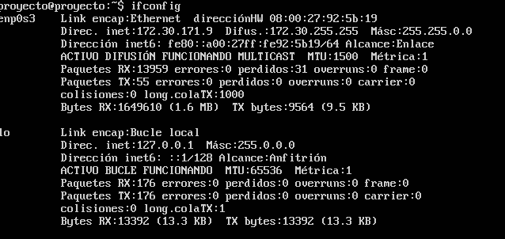
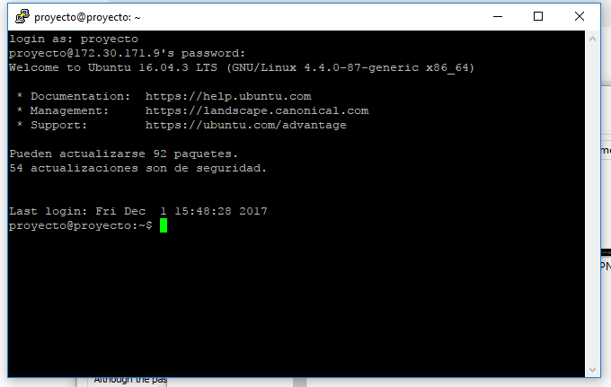
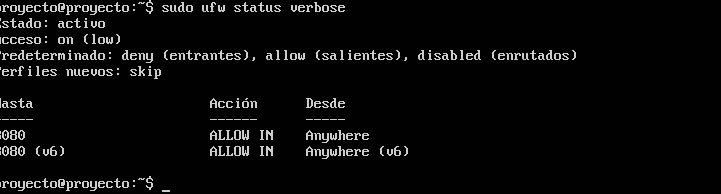
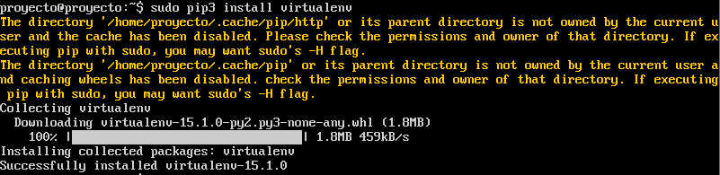
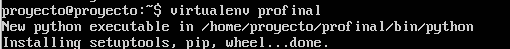
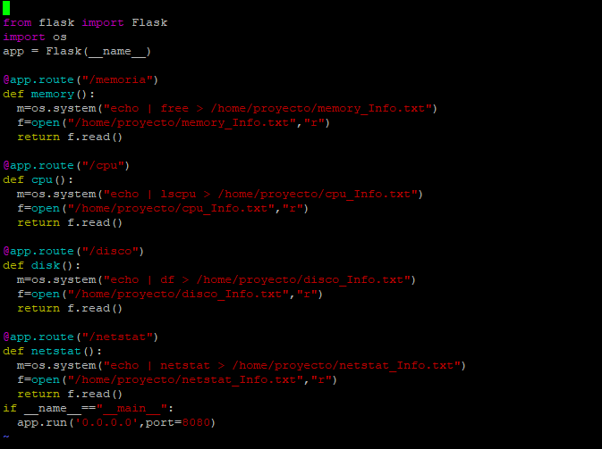

## Miniproyecto Sistemas Operativos

**Universidad ICESI**  
**Curso:** Sistemas Operativos  
**Docente:** Daniel Barragán C.  
**Tema:**  Servicios web  
**Correo:** daniel.barragan at correo.icesi.edu.co

**Estudiante: A00141804**  
**Nombre: Carlos Andrés Torres López**  

## Objetivos
* Desplegar una aplicación en un servidor que ejecuta el sistema operativo Linux
* Realizar los ajustes y depuración necesarios para desplegar una
aplicación en Linux
* Realizar aplicaciones para obtener información del sistema operativo

## Descripción
Para el despliegue de una aplicación en un servidor se requiere conocer los procedimientos necesarios relacionados con la configuracion de las interfaces de red, ajustes de seguridad, instalación de dependencias, usuarios y herramientas de depuracíon del sistema operativo.

El siguiente proyecto consiste en el despliegue de una aplicación web para obtener información del sistema operativo (La aplicación debe permitir consulta uso de CPU, memoria y espacio en disco). Para este propósito se debe emplear el sistema operativo Ubuntu Server 16.04, el microframework flask y ambientes virtuales.

  

## Actividades
* Nombre y código de todos los integrantes del grupo (máximo 3) (5%)
* Ortografía y redacción (5%)
* Descripción breve de los pasos para cumplir con lo solicitado
  * Sistema operativo Ubuntu Server 16.04 (10%)
  * Configuración de interfaces de red (10%)
  * Configuración de puertos (10%)
  * Instalación de dependencias (10%)
  * Creación de ambientes virtuales (10%)
  * Aplicación en Python (10%)
  * Validación de la ejecución del servicio (netstat) (10%)
* Pruebas de la solución a través de capturas de pantalla. Puede emplear si lo desea una herramienta de captura de pantalla a formato .gif (10%)
* El informe debe ser entregado en formato pdf a través del moodle y el informe en formato README.md debe ser subido a un repositorio de github. El repositorio de github debe ser un fork de https://github.com/ICESI-Training/so-project y para la entrega deberá hacer un Pull Request (PR) respetando la estructura definida. El código fuente y la url de github deben incluirse en el informe (10%).

## Solución
1. Como primer paso se descargo y se instalo el Ubuntu server desde el link que aparece como referencia.  
Como usuario se configuro un usuaurio Proyecto con la misma contraseña.
2. se procedio a configurar las interfases, en este punto tuve bastantes problemas ya que mi maquina esta configurada bajo una red cerrada y solo funcionaba con iP fija, pero lo solucione trabajando con la red inalambrica. y tuve que deshabilitar el firewall para poder conectarme por ssh. como muestro a continuación y tambien la información de red: 

Firewall:  

    

  

Configuración de red:  

    

  

y asi me pude conectar por SSH :

    

  

3. Inicialmente se instala el phyton, pero debido a que con la evrsión que instala del phyton tenia problemas, tuve que actualizar la versión del pip (herramienta de phyton que permite instalar dependecias) para que me dejara instalar  el virtualenv, como muestro a continuaciíon:

    

  

4.Luego de eso proceso a abrir habilitar los puertos:  

    

  

5. Luego de esto se instala el virtualenv:  

    

  

6.Luego se crea el ambiente virtual sobre el que se va a trabajar y se va a crear el servicios Web:  

    

  

7. y se activa el ambiente virtual:  

    

  

8. Luego de esto se instala la dependencia del flask para montar el servicio web :  

    

  

9. Luego de esto se debe crear un script.py que es el que va a contener el codigo que va a entregar la información del sistema por medio del servicio web, el nombre que le puse al script es servicio.py, a continuación muestro el contenido del archivo:  

    

  

 10.Luego inicio el servicio ejecutando el script servicio.py que contiene el codigo de la imagen anterior:  
 
 

    

  
 
 
## Referencias  

* https://www.ubuntu.com/download/server
